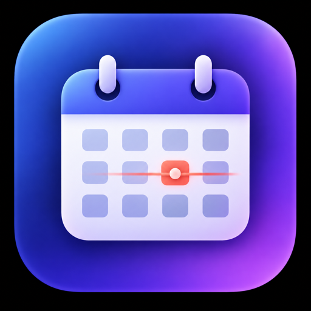
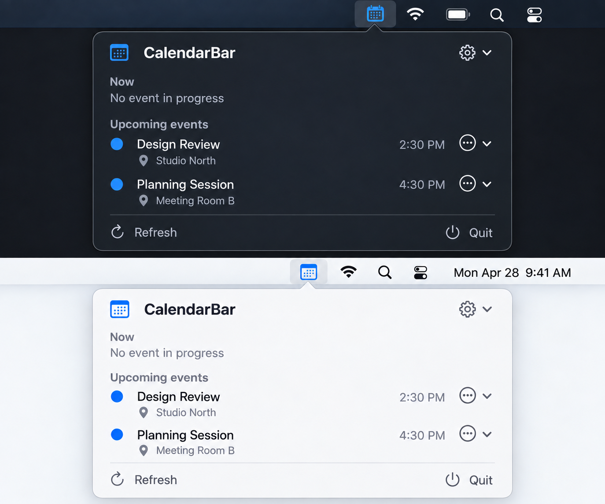

<div align="center">
  
  <h1>CalendarBar</h1>
  <p>A small macOS menu-bar app that shows what's on your calendar now and what's coming up next.</p>
  <p>
    macOS 14+ · No third-party dependencies · No networking · <a href="LICENSE">MIT</a>
  </p>
</div>



<sub>Mockups use fictional sample events.</sub>

## Install

**Homebrew**

```bash
brew install --cask treeot/tap/calendarbar
```

**Direct download:** grab the latest `.dmg` from
[Releases](https://github.com/treeot/CalendarBar/releases) and drag
**CalendarBar** into **Applications**.

**First launch:** releases are ad-hoc signed, not notarized, so Gatekeeper will
warn you. Control-click **CalendarBar.app** in Applications → **Open** →
**Open**. If it's still blocked, go to **System Settings → Privacy & Security**
and click **Open Anyway**.

Then choose **Allow Full Access** when asked for calendar access. CalendarBar
lives in the menu bar only, with no Dock icon.

## Usage

- Click the menu-bar item to see the current event under **Now** and the rest of today under **Upcoming events**.
- Each event can open Apple Calendar or copy its title.
- Display modes: **Full**, **Compact** (default), or **Icon Only**.
- Hold `⌘` and drag the menu-bar item to reposition it.
- Refreshes every 60 seconds and on any calendar change. All-day events are hidden.

### Calendar access

If access was denied, use the app's **Open System Settings** button, or go to
**System Settings → Privacy & Security → Calendars → CalendarBar**.

### Launch at login

Enabled on first run; toggle it from the CalendarBar menu. It works reliably
only from a copy in `/Applications`, not from Xcode builds. macOS may ask you to
approve it in **System Settings → General → Login Items & Extensions**.

## Development

Requires Xcode 15+. Open `CalendarBar.xcodeproj`, pick the **CalendarBar**
scheme and **My Mac**, then press `⌘R`.

Build and test from the command line:

```bash
xcodebuild build \
  -project CalendarBar.xcodeproj \
  -scheme CalendarBar \
  -configuration Debug \
  -destination 'platform=macOS' \
  -derivedDataPath .build/DerivedData \
  CODE_SIGNING_ALLOWED=NO

xcodebuild test \
  -project CalendarBar.xcodeproj \
  -scheme CalendarBar \
  -destination 'platform=macOS' \
  -derivedDataPath .build/DerivedData \
  CODE_SIGNING_ALLOWED=NO
```

CI runs both on pushes and pull requests to `main`.

### Releasing

Push a `vMAJOR.MINOR.PATCH` tag. GitHub Actions builds an unsigned DMG and
publishes the release.

```bash
git tag v1.0.0
git push origin v1.0.0
```

## License

[MIT](LICENSE)
